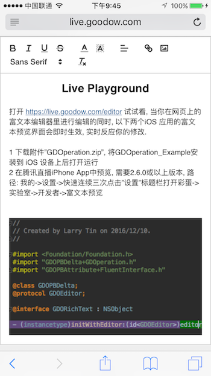
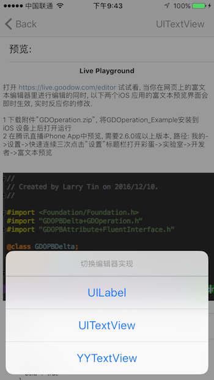

# GDOperation

## Installation

GDOperation is available through [CocoaPods](http://cocoapods.org). To install
it, simply add the following line to your Podfile:

```ruby
pod "GDOperation"
```

## Quickstart

```objective-c
// 使用 UITextView 创建 GDORichText
UITextView *textView = ...;
GDORichText *richText = GDOTextView.attachView(textView);
// 或者使用 UILabel 和 YYTextView
// GDORichText *richText = GDOLabel.attachView(uiLabel);
// GDORichText *richText = GDOYYTextView.attachView(yyTextView);

// 在索引 0 处插入文本"Hello World!", 同时指定文本颜色和点击链接
richText.insertText(0, @"Hello World!",
    GDOPBAttribute.new.setColor(@"#cccccc").setLink(@"schema://views/GiftPanel?k=v"));
```

## Live Playground
打开 https://live.goodow.com/editor 试试看, 当你在网页上的富文本编辑器里进行编辑的同时, iOS 应用里的富文本预览会即时生效, 实时反应你的修改. 要在 iOS 上预览, 可以:
  - 运行 [Example 工程](https://github.com/goodow/GDOperation/tree/master/Example)
    - `git clone https://github.com/goodow/GDOperation.git`
    - `cd GDOperation/Example; pod install`
  - 在 AppStore 上下载 [腾讯直播](https://itunes.apple.com/cn/app/id1059716058), 打开路径: 我的->设置->快速连续三次点击"设置"标题栏打开彩蛋->实验室->开发者->富文本预览

网页编辑|iOS Example 工程预览
---|---
|

## Delta: 富文本的数据模型

富文本的数据来源有两类: 后台下发和使用客户端 API 创建.
这些数据最终将被转换成一个NSAttributedString来表示内容和样式. 由于iOS自身的限制, 三种界面实现所支持的特性丰富程度依次为: UILabel < UITextView < YYTextView. 例如UILabel不支持链接的点击事件, 只有YYTextView可支持任意自定义视图元素, 所以引入第三方界面组件[YYText](https://github.com/ibireme/YYText)扩展了NSAttributedString以支持Button等控件.

#### 后台下发

后台下发数据是目前用得最多的场景. 支持 Google Protobuf ([.proto 文件](protos/goodow_operation.proto)) 和 JSON 数据格式. JSON 格式可以在 [Live Playground](https://live.goodow.com/editor) 上进行编辑和观察.

```objective-c
// 使用 UITextView 创建 GDORichText
UITextView *textView = ...;
GDORichText *richText = GDOTextView.attachView(textView);

// 创建数据模型, 反序列化自JSON, JCE 或 Protobuf
NSDictionary *json = @{@"ops": @[
    @{
      @"insert": @"Hello World!",
      @"attributes": @{
        @"color": @"#cccccc",
        @"link": @"txlive://views/GiftPanel?a=b",
      }
    },
    @{
      @"insert": @"\n", // 换行符表示一个段落的结束, 这里的样式作用于整个段落
      @"attributes": @{
        @"align": @"center"
      }
    }
  ]};
GDOPBDelta *delta = [GDOPBDelta parseFromJson:json error:nil];
// 更新界面
richText.updateContents(delta);
```


#### 客户端 API

iOS 提供 Objective-C 语言的 API, 使用链式形式调用

```objective-c
// 调用API创建数据
GDOPBAttribute *attributes = GDOPBAttribute.new.setColor(@"#cccccc").setLink(@"txlive://views/GiftPanel?a=b");
GDOPBDelta *delta = GDOPBDelta.new.insert(@"Hello", attributes).insert(@" World!", nil);
// 更新界面
richText.updateContents(delta);
```

## Formats

GDOperation支持很多种格式, 分为三类: Inline, Block, Embeds.

#### Inline 字符样式

  - Color - `color` 字符着色
  - Background Color - `background` 背景色, "#cccccc", Uses six character hex values to represent colors
  - Size - `size` 字号
  - Font - `font` 字体
  - Link - `link` 链接
  - Bold - `bold`  字重, false: UIFontWeightLight, true: UIFontWeightBold
  - Italic - `italic` 斜体
  - Underline - `underline` 下划线
  - Strikethrough - `strike` 删除线
  - Inline Code - `code`
  - Superscript/Subscript - `script`

#### Block 段落样式

  - Text Alignment - `align` 对齐方式

#### Embeds 非文本类型界面元素

  - Image - `image` 图片, 值可以为以下类型:"http[s]://xxx", "file://abc", "file:///Documents/abc.jpg", "data:image/png;base64,xyz==". 可指定 width, height, link 等属性
  - Button - `button` 按钮, 仅YYTextView支持, 字符串值将为按钮的标题
  - Space - `space` 空白占位

## Comparison Table

|  | UILabel | UITextView | YYTextView | UIWebView |
| ------------ | ------------ | ------------ | ------------ | ------------ |
| 底层数据格式 | NSAttributedString | NSAttributedString | NSAttributedString | HTML |
| 链接事件 | No | Yes | Yes | Yes |
| 图片 | Yes | Yes | Yes | Yes |
| 可编辑 | No | Yes | Yes | Yes |
| 嵌入自定义元素 | No | No | Yes | No |

相较于 WebView 方案, GDOperation 更加轻量, 当需求变得复杂时, 可定制化开发自定义元素, 因而具备更强的可扩展性.


## Author

Larry Tin, dev@goodow.com

## License

GDOperation is available under the MIT license. See the LICENSE file for more info.
